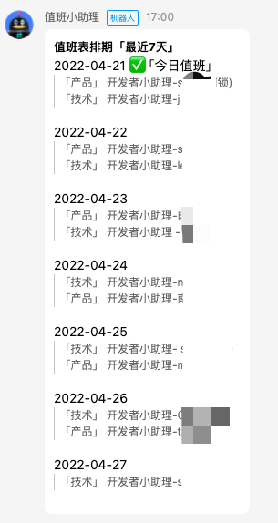
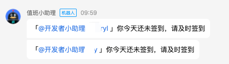
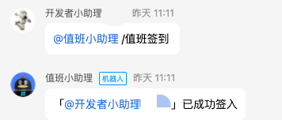
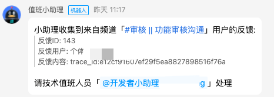
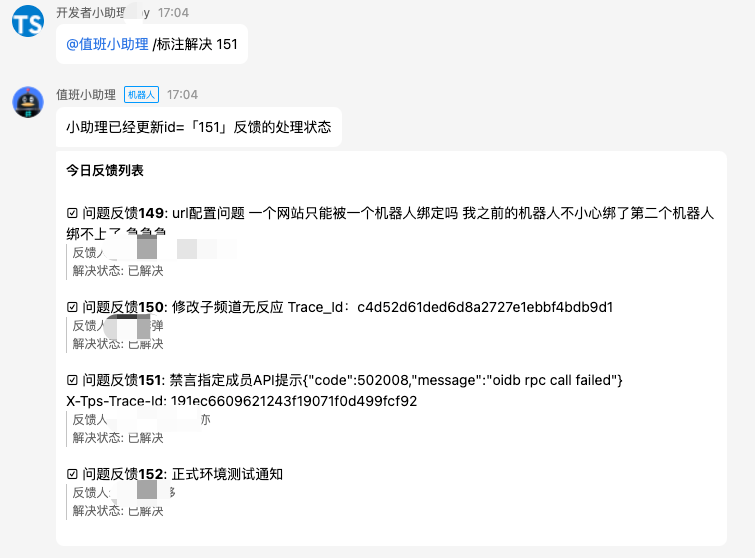

# 值班小助理
该代码库是基于QQ机器人框架进行开发的机器人，用于服务开发者社区的值班签到、值班通知、及问题反馈、产品建议等工作流的自动处理  
>**QQ机器人介绍**   
QQ机器人是基于QQ开放生态的高级扩展服务，通过开放的接口，能够与QQ频道用户实现交互形式丰富的互动。  
[QQ机器人文档入口](https://bot.q.qq.com/wiki) [PythonSDK使用说明](https://bot.q.qq.com/wiki/develop/pythonsdk/)

## 效果展示
机器人使用了MD的消息作为主要的推送消息类型，效果见下面示例
### 查看值班表


### 工作流提醒


### 值班签到及签出



### 问题反馈


### 反馈查看及标注解决



## 使用方法
使用代码库前需要配置好相关的信息，可以跟随下面的步骤进行
### 环境安装
py包的依赖配置，通过`pip install -r requirements.txt` 可以安装所有的依赖包

### 数据库导入
通过执行bot_onduty的sql语句可以导入到你自己的数据库中
- **数据库：bot_onduty 类型`mysql`**
  - t_feedback 反馈表
  - t_owner 值班表
  - t_sign 签到表

### 环境配置
拷贝根目录的 `config.example.yaml` 为 `config.yaml`
```shell
cp config.example.yaml config.yaml
```

修改 `config.yaml` ，填入自己的 BotAppID 和 Bot token 以及其他相关参数，参数介绍如下

```shell
token:
  appid: "123" # 机器人appid
  token: "xxx" # 机器人token
database:
  host: "x.x.x.x" # Mysql数据库服务IP地址
  port: 3306 # Mysql数据库服务端口
  db: "db_xxx" # Mysql数据库连接database名字
  user: "mysql" # Mysql数据库连接用户名
  password: "mysql_xxx" # Mysql数据库连接password
params:
  channelId: "123456" # 默认的推送子频道id
  userId: "1234567890" # 默认的值班人员userId
  userName: "bot" # 默认的值班人员名字
webhook:
  qwx: "https://qyapi.weixin.qq.com/cgi-bin/webhook/send?xxx" # 企业微信机器人通知的webhook地址
```

### 运行机器人
在代码库根目录执行下面命令
```shell
python3 run.py
```

## 代码说明
```
.
├── LICENSE
├── README.md
├── config(demo).yaml   # 配置文件模版
├── config.yaml         # 实际的读取配置文件（需要自己从demo复制一份修改参数）
├── constant            # 代码常量，包含md模版、通知模版、类型等
│ ├── type.py               # 类型常量
│ └── words.py              # 推送模版常量
├── dao                 # 数据库操作层，处理数据库连接以及业务逻辑的sql
│ ├── db.py                 # 数据库工具
│ ├── feedback.py           # 反馈相关的数据操作
│ ├── owner.py              # 值班人员相关的数据操作
│ └── sign.py               # 签到相关的数据操作
├── flow                # 工作流，包含通知和定时处理任务
│ ├── reply.py              # 机器人回复相关的处理
│ └── schedule.py           # 机器人定时任务
├── requirements.txt    # py包的依赖配置，通过`pip install -r requirements.txt` 可以安装所有的依赖包
├── run.py              # 程序运行入口，包括不同指令的处理
├── service             # 依赖外部的服务
│ └── qwx_api.py            # 企业微信的推送
└── util                # 工具包
    ├── decorated.py        # 指令及权限的装饰器处理
    └── string.py           # 字符相关的处理
```

## 未来计划
### 增加数据源
- 接入频道帖子的数据，把多渠道的数据整合成同层数据方便后续通知跟进解决【正在开发】
- 接入机器人FAQ的反馈数据

### 分析能力 
- 通过接出反馈及值班相关的数据做一层etl，形成可视化的报表

### 多渠道打通
- 考虑如何打通多种通知能力的平台